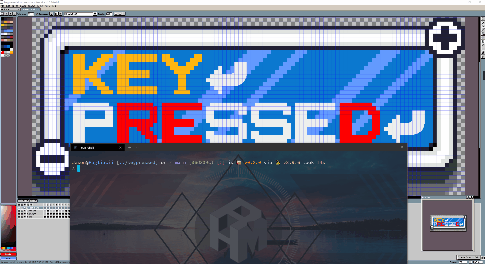

# KeyPressed

> Wait, which key you pressed?

<p align="center">
    
    <a href="https://www.python.org/">
        
    </a>
    =3.7,<3.10-c1282d?style=for-the-badge&logo=python" alt="Made with Python">
    
</p>

## Overview

This one can show your pressed key on the screen. It is useful when you're sharing your screen because somebody will be curious what key did you pressed.

### Why?

- This project was inspired by [Screenkey](https://www.thregr.org/~wavexx/software/screenkey/).
- When I was sharing my screen with my friend, he asks me several times which key I pressed. So I try to find software that can show my pressed key on the screen.
- After trying some software, I decided to write this project to satisfy my needs.

## Install

If you are the [poetry](https://python-poetry.org/) user:

```shell
# Clones this repo
$ git clone https://github.com/Pagliacii/keypressed
$ cd keypressed
# Installs the dependencies
$ poetry install --no-dev
# Runs
$ poetry run python main.py
```

Others:

```shell
# Clones this repo
$ git clone https://github.com/Pagliacii/keypressed
$ cd keypressed
# Installs the dependencies
$ pip install -r requirements.txt
# Runs
$ python main.py
```

## Usage



## Tested Platforms


## Built with

- [PySide6](https://pypi.org/project/PySide6/) - Provides access to the complete Qt 6.0+ framework
- [pynput](https://pypi.org/project/pynput/) - This library allows you to control and monitor input devices.

## TODO

- [ ] Build and release the binary package.
- [ ] Use GitHub Actions to build and release automatically.
- [ ] Test on other platforms.

## License

This project is licensed under the MIT License - see the [LICENSE](LICENSE) file for details.

## Acknowledgments

- [Aseprite](https://github.com/aseprite/aseprite) - A great pixel art tool
